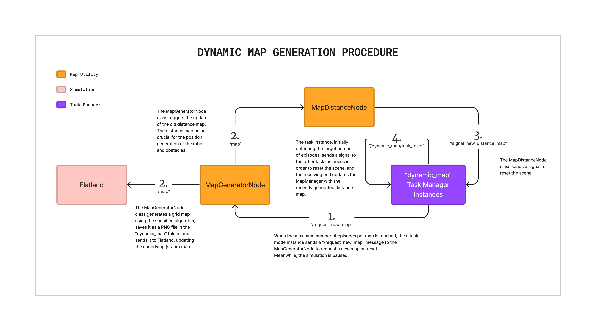

# MAP-GENERATOR

The Map-Generator encapsulates the option of providing different algorithms for static map generation.

- Factory Design Pattern - modular design for easy implementation of further map algorithms
  - e.g. Rosnav, Barn
- Add the decorator "MapGeneratorFactory.register()"

```python
@MapGeneratorFactory.register("rosnav")
```

- Configuration file at: "_arena-rosnav/arena_bringup/params/map_generator.yaml_"

## IMPLEMENTATION OF NEW ALGORITHMS
- For the new algorithm inherit from the base class: `BaseMapGenerator`
  - Implement these functions:
    -  ```update_params()```
    -  ```retrieve_params()```
    -  ```generate_grid_map()```
-  Update the configuration file by adding the algorithm parameters to a dedicated section under _generator_configs_.

## MECHANISM



| Line | Publisher        | on topic                   | Subscriber       |
| ---- | ---------------- | -------------------------- | ---------------- |
| 1    | TaskMode         | "/request_new_map"         | MapGeneratorNode |
| 2    | MapGeneratorNode | "/map"                     | FlatlandNode     |
| 3    | MapGeneratorNode | "/map"                     | MapDistanceNode  |
| 4    | MapDistanceNode  | "/signal_new_distance_map" | TaskMode         |
| 5    | TaskMode         | "/dynamic_map/task_reset"  | TaskMode         |

Class | on topic | Class

### 1. TaskMode | "/request_new_map" | MapGeneratorNode

- When the maximum number of episodes per map is reached, the a task mode instance sends a "/request_new_map" message to the MapGeneratorNode to request a new map on reset.
Meanwhile, the simulation is paused.

### 2. MapGeneratorNode | "/map" | FlatlandNode

- The MapGeneratorNode class generates a grid map using the specified algorithm, saves it as a PNG file in the "dynamic_map" folder, and sends it to Flatland, updating the underlying (static) map.

### 2. MapGeneratorNode | "/map" | MapDistanceNode

- The MapGeneratorNode class triggers the update of the old distance map. The distance map being crucial for the position generation of the robot and obstacles.

### 3. MapDistanceNode | "/signal_new_distance_map" | TaskMode

- The MapDistanceNode class sends a signal to  reset the scene.

### 4. TaskMode | "/dynamic_map/task_reset" | TaskMode

- The task instance, initially detecting the target number of episodes, sends a signal to the other task instances in order to reset the scene, and the receiving end updates the MapManager with the recently generated distance map.

## NEW TASK MODES

### DYNAMIC MAP RANDOM MODE - "dm_random"
Equivalent of random mode with dynamic map.

### DYNAMIC MAP STAGED MODE - "dm_staged"
Equivalent of staged mode with dynamic map.